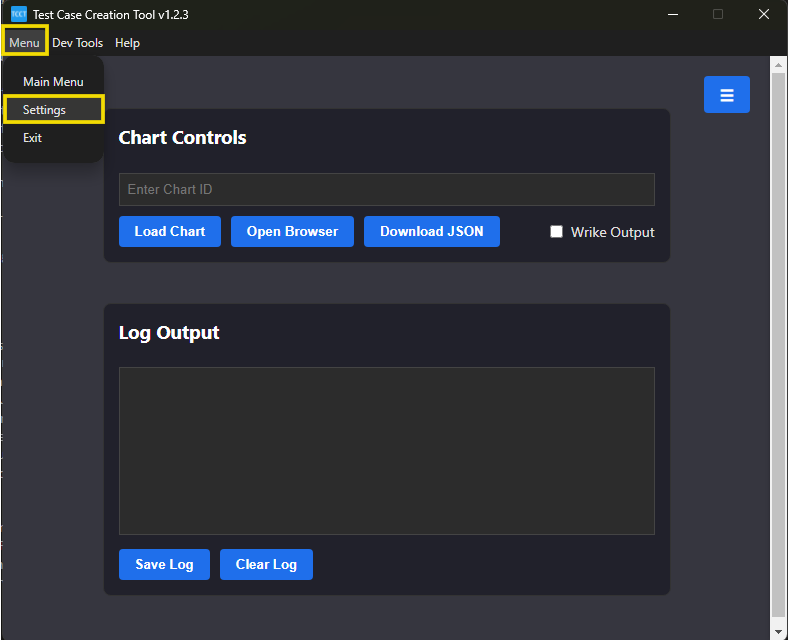
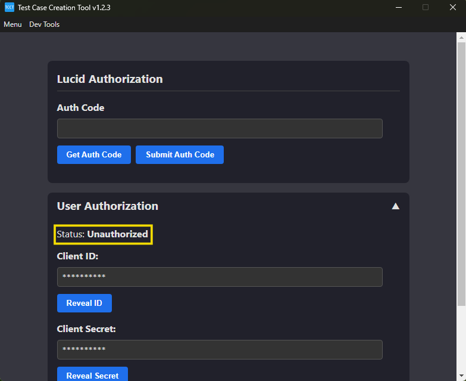
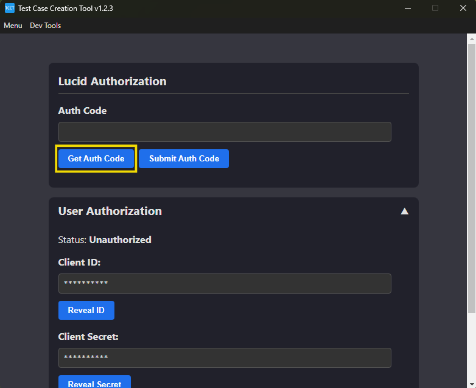
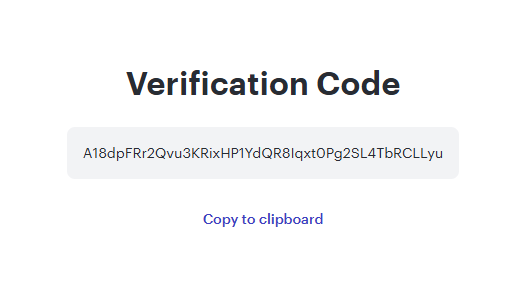

# Authorizing Within The TCCT

The Test Case Creation Tool uses external APIs to gather information from the Lucid call flow diagrams which users provide. Because of the use of external APIs, authorization is a required step to using the TCCT. This guide will go over how to authenticate inside of the TCCT. This only needs to be done once and the data received in the authorization process will be stored locally on your machine to handle the process in the background during future use.

This guide assumes you already have the Test Case Creation Tool downloaded and installed onto your system. If you do not yet have it installed, please see the README.md.

## 1. Check Your Authorization Status 🔍

- With the Test Case Creation Tool open, go to the "Settings" screen.
  - This can be found by selecting "Menu" and then "Settings" in the top left of the TCCT application.
    
- Within the settings page, select "User Authorization" to see your authorization status.
  

## 2. Request Authorization Code 🚨

- If you are not authorized, select the "Get Auth Code" button within the "Lucid Authorization" section.
  
- This should open to a Lucid webpage that provides an authorization code to copy.
  

## 3. Submit Authorization Code ✅

- Paste the authorization code from Lucid into the "Auth Code" text area and press "Submit Auth Code"
  
- The authorization data is saved so that this process only needs to be done once.
