# About Lucidchart and the Test Case Creation Tool (TCCT)

Lucid Chart is a web-based diagramming application that the Professional Services team uses as a replacement for Visio. The Professional Services team has also developed an in-house tool called the Test Case Creation Tool (TCCT) using the Lucidchart API that extracts the contents of a call flow and rebuilds it into easy-to-use test case document. These test cases will be used for internal QA and customer end user testing (EUT).

[For information on how to use the Test Case Creation Tool, click here](./BASIC-USE.md).

## Ignoring Items or Pages

The PS Lucid Chart Template comes with a reference page for all shapes. To get the TCCT to ignore this page or anything that you may want it to ignore, do the following:

1. Select all items that you want ignored. (Ctrl + A)
2. Cut all of the selected items from the page. (Ctrl + X)
3. Select the `Layers` icon on the bottom naviation bar within Lucidchart.
4. Use the `Add new layer` button.
5. Name the new layer `Ignore`.
6. While the top of the current page in LucidChart says `Page Name > Ignore`, paste the items into the ignore layer. (Ctrl + V)

The shapes in this layer will now be ignored by the TCCT. To escape the `Ignore` layer, press escape.

## Shapes

Custom shapes were created to be able to control data that is used within the TCCT. Below you will see a basic description and image of each of the shapes used to create call flows in Lucidchart. You can create your own shapes or use Lucidchart standard shapes in your call flows, but the TCCT tool ignores those shapes. If you need a test case for the logic you are building, you must use the CXone shape library in Lucidchart. [Use the Lucidchart template referenced here in Best-Practice Techniques for Requirements Gathering for ACD-IVR Builds: Business Unit and Studio](https://niceincontact.my.salesforce.com/articles/Knowledge/Best-Practices-Techniques-for-Requirements-Gathering-for-ACD-IVR-Builds-Central-Studio).

### Annotation

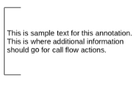

Capture notes or additional details relevant to the page or a specific shape on the page.

- Annotations will not provide any information to the TCCT.

### Assign

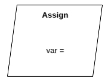

Stores a value in the specified variable name for later use in the flow using the format: variableName = value. 

- Multiple lines can be used to assign multiple variables using a single shape.
- String values should be surrounded by double quotes.

- The Assign shape can also use IF/ELSE, CASE, or SELECT statements to do conditional assignments. The following format should be precisely followed for use by the UAT Generator. Curly brackets must always be on their own line, not included at the end of the preceding line. 

```
IF variable = value 
{ 
  myVar = firstValue 
} 
ELSE 
{ 
  myVar = secondValue 
} 

SWITCH variable 
{ 
  CASE “123” 
  { 
    myVar = firstValue 
  } 
  CASE “456” 
  { 
    myVar = secondValue 
  } 
  DEFAULT 
  { 
    MyVar = thirdValue 
  } 
} 

SELECT 
{ 
  CASE variable = value 
  { 
    myVar = firstValue 
  } 
  CASE variable = otherValue 
  { 
    myVar = secondValue 
  } 
  DEFAULT 
  { 
    myVar = thirdValue 
  } 
}
```
### Begin

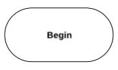

The starting point for any chart page.  Only a single Begin action should be present on a page. 

### Case


The Case shape uses the specified variable and based on the variable’s value will follow the line with the matching value.  

- You can list multiple values on a line by separating them with a forward slash ‘/’.  
- `Default` can be specified on a line to indicate the line should be used if no other line’s value matches.  
- Only a single line can be default per shape. 
- The curly brackets around the variable name are optional.  
- You cannot use expressions on the Case shape, use the If shape instead.

Example:

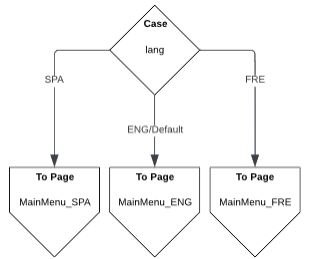

### Check Hours

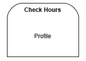

Performs a check of the specified hours profile. 

- Best practice is to specify the profile id and name. Example: `123 – Sales`
- Lines/branches off the shape should be labeled with the various outcomes that need to be handled. 

### Email

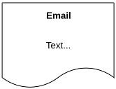

Sends an email.

- The text of the Email shape should be a brief name or description.
- The TCCT will generate a test line such as “Email sent: <Text>”.
- The `Emails` shape can be used to fully detail the recipients and content, allowing for a simpler name in the flow but still capturing full details within the chart page.

### Emails

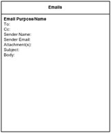

Emails can be listed here for additional clarity.
- The Emails shape should typically be placed in the top right corner of the page, below the Prompts shape and include only emails used on that page.
- The shape should not be connected to any other shapes. It should be on the `Ignore` layer.
- The “Email Purpose/Name” should be replaced with the descriptive name used on the `Email` action.

### Entry

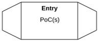

Represents an entry point into scripting. For phone scripting these would be POC #s. For email scripting it would be email addresses.
- Used by the TCCT to identify starting entry points within the chart.
- Multiple values should be listed, one per line.
- POC values cannot be repeated, even on different pages.

### Get Data

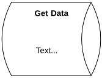

Get additional data from another source. Note that the Web Service shape should be used for web API requests.

### Go To

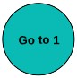

Used to jump between two points on the chart without using a connecting line. Useful for large or complicated charts where the distance between two shapes would create confusion or overlap too many other shapes or lines. It should be used sparingly to avoid confusion.

The Go To shape is not recognized by the TCCT and should be used for visual clarity only. These shapes and their connecting lines can be placed on the `Ignore` layer.

- At least two Go To shapes will be required, one (or more) as source locations, and one as the destination to go to. Shapes need to have the following text:
  - Sources: Go to #
  - Destinations: #
- The # must be unique across the entire chart, not just the page.
- When using multiple Go To #s it is recommended to change the background color of each new #.
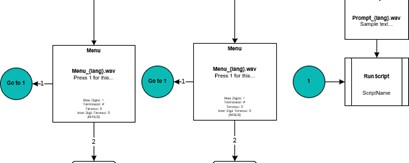

### Hang Up

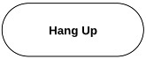

Hang up or end the current contact.

### If

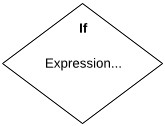

Checks if the specified expression is true, or false, and follows the line with the matching label. Simple expressions can be formatted as: DNIS = 8885551234
- The If shape must have a `True` and a `False` line. Other lines will be ignored.
  
### Loop

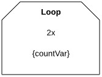

Loops and repeats the specified number of times, taking the line labeled `Repeat` until the counter is exceeded at which point the `Finished` line is taken.

- The maximum number of times to repeat should be specified as #x. (Example: `2x`, `5x`, etc.)
- The default `{countVar}` variable can be renamed if the variable value will be needed elsewhere in scripting.

The loop shape must have `Repeat` and `Finished` lines. Other lines will be ignored.

### Marquee

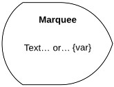

Display the specified information as a marquee banner to the active agent.

### Menu

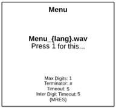

Presents a menu to the caller and plays the specified prompt(s).

Specify the full prompt filename including extension, but do not include the prompt path (folders).
- A description of the prompt content can optionally be included as a new line after the prompt name.
- Change the menu setting details if needed to match the desired menu behavior.
- The default menu result variable `{MRES}` can be renamed if the menu result value will be needed at a later point in the call flow.

### Note

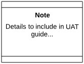

A generic shape that can be used to convey information.

- These shapes should be used sparingly and only when there is not another shape that fits the need.
- These shapes provide no specific value in the TCCT output.

### Play

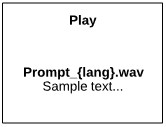

Play the specified prompt(s).
- Specify the full prompt filename including extension, but do not include the prompt path (folders).
- A description of the prompt content can optionally be included as a new line after the prompt name.

### Prompts

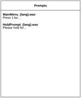

Prompt names and their content can be listed here for additional clarity.
- The Prompts shape should typically be placed in the top right corner of the page and include only prompts used on that page.
- The shape should not be connected to any other shapes. It should be placed on the `Ignore` layer.

### Request Agent

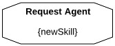

Request an agent from the specified skill.
- Best practice is to set the `{newSkill}` variable earlier in scripting to store the skill to be requested.

### Return

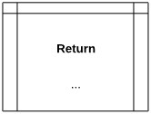

Return from the current page to the previous page where a RunSub shape was used.

### RunScript


Run and transfer control to the specified script. Any shapes after this action in the current page will be ignored.

### RunSub

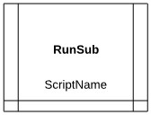

Run the specified subscript, wait for the subscript to hit a Return shape, and then continue.
- If the chart has a page with a matching name the TCCT will include the flow on that page.

### ScreenPop

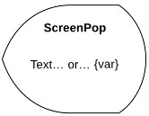

Display the specified information to the current agent.
- Resize the shape as needed to fit longer content, or use an Assign shape beforehand to set the content to a variable.

### Spawn

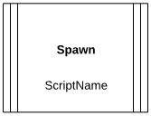

Run the specified script as a separate task and continue with the next shape in the current flow.
- The Test Case Creation Tool ignores Spawn actions.

### To Page

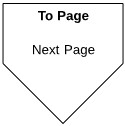

Goes to the Begin shape on the specified page within the chart.
- The specified page name must match the chart page name exactly.

### Transfer (Blind)


Performs a blind transfer to the specified phone number and ends the CXone contact.

### Transfer (Managed)

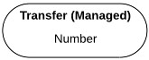

Performs a managed transfer to the specified number, leaving the contact active on the CXone platform and scripting and continues to consume ports.

### Webservice

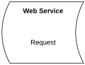

Make a request to the specified web service API to post or get data.
- A brief name should be used for the request details, which then maps to the full API details in the CXone workbook.
- Examples:
  - CaseUpdate
  - POST: CaseUpdate
  - GetAccountInfo
